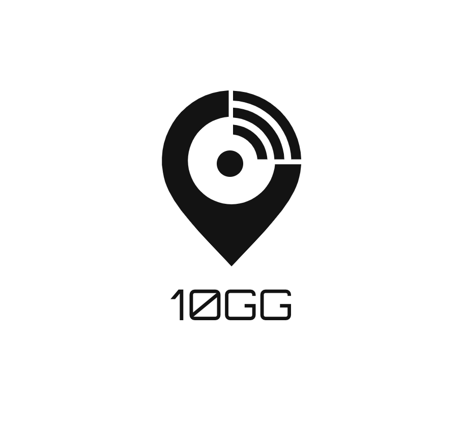

# 10gg
<div align="center">
  <br><br>
</div>

## Overview
**10gg** is A log analysis tool for [TiDB](https://github.com/pingcap/tidb). The basic idea of this project comes from the daily problems encountered in ours work. 

## Getting Started

#### Prerequisite
Python3 and Pip3 should be installed in your system.

#### Usage
```bash
git clone https://github.com/10gg/10gg.git
cd 10gg
python3 main.py
```

## License
10gg is under the [Apache License 2.0](LICENSE).